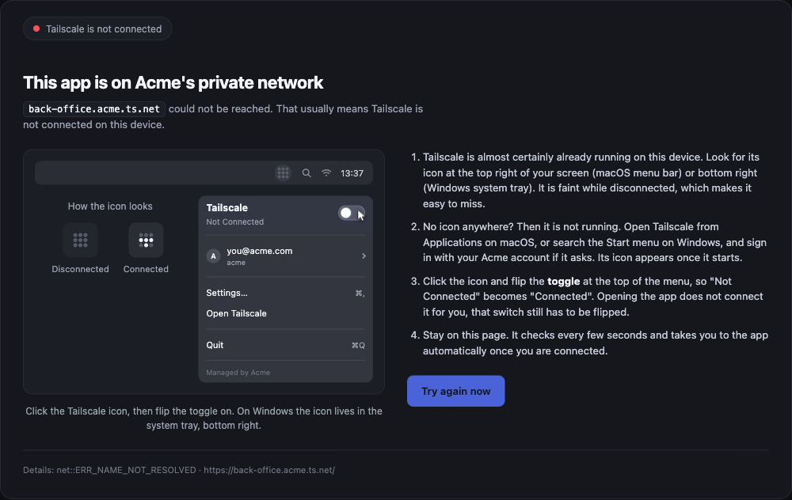
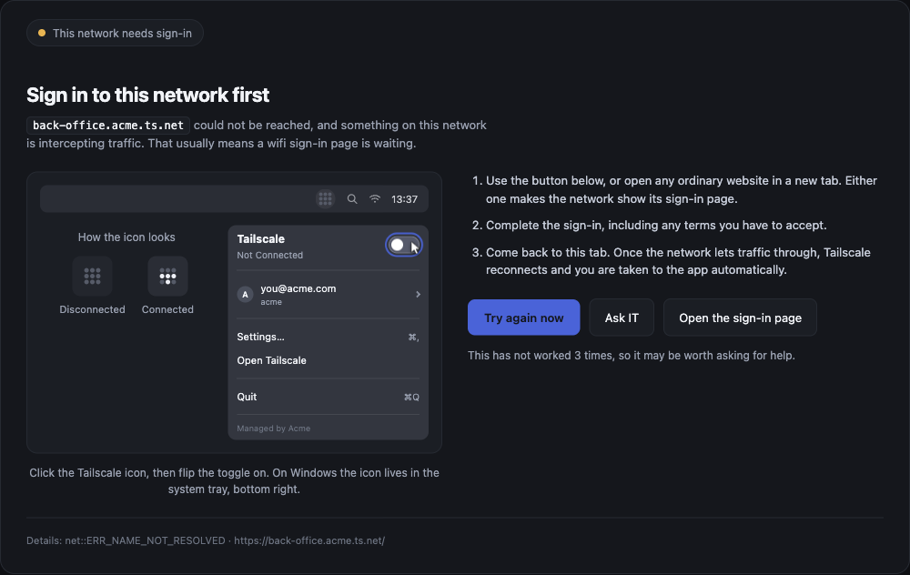
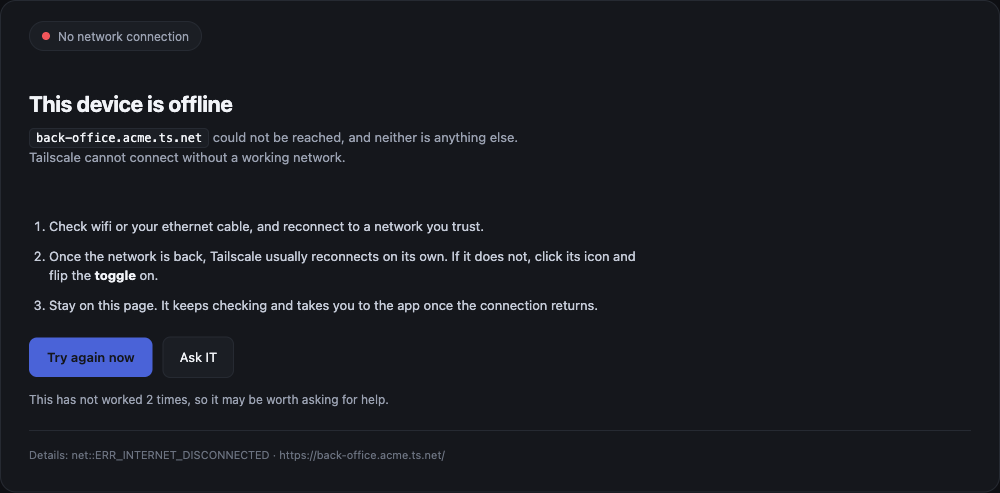
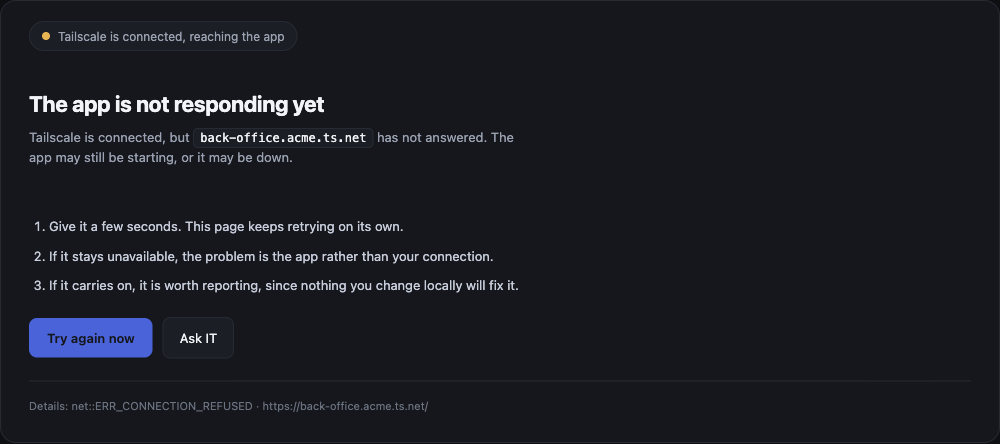
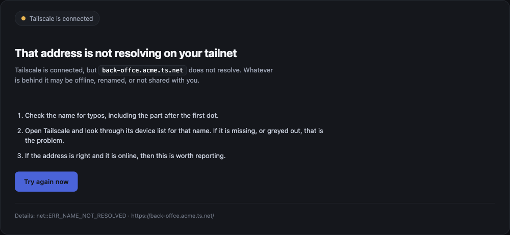
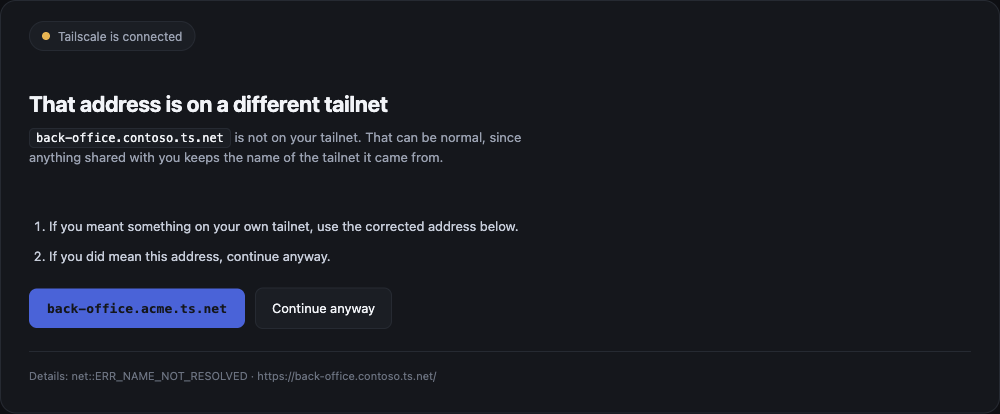

# Tailnet Connection Helper

When someone opens a Tailscale app and the tunnel is down, Chrome shows this:

> **This site can't be reached**
> `back-office.acme.ts.net`'s server IP address could not be found.
> `ERR_NAME_NOT_RESOLVED`

Nothing on that page mentions Tailscale, so the user raises a ticket. This extension
replaces it with a page that names the cause, shows where the client lives on their
machine, and sends them back to the app automatically once the connection returns.



One published extension serves any organisation. Everything a user reads comes from Chrome
policy, so there is nothing to fork and nothing baked into the build.

## What your users will see

The page is not one screen. It works out *why* the app was unreachable and says something
different for each cause, because "flip the Tailscale toggle" is wrong advice four times
out of six.

### Tailscale is not connected

The common case. Names the cause, shows the icon in both states so it can be found in a
menu bar, and demonstrates the toggle.


### This network needs a sign-in first

A hotel or café portal is intercepting traffic. Telling someone to flip a toggle here
would waste their time, so the page offers to open the sign-in page instead.

This shot also shows the escalation route, which appears only after repeated failures and
only when an administrator has configured a support link.



### The device is offline

No network at all. Tailscale being down is a symptom here, not the cause, so the page
leads with the network and drops the client illustration entirely.



### The app is not answering

Tailscale is connected and the host still did not respond. This is the one case where
nothing the user does will help, so the support route appears immediately rather than
after a retry.



### That name does not resolve on your tailnet

Tailscale is connected, but the name does not exist. Usually a typo, sometimes a device
that is off or not shared. The page points at the device list rather than the toggle, and
deliberately does not tell the user to report it.



### That address is on a different tailnet

Someone reached a host on another organisation's tailnet. The page offers the corrected
address and a way past it, because a suggestion you cannot decline is an interception. Off
by default.



## Install it

**For an organisation.** Force-install the extension by ID through Chrome policy, then
push the configuration below. Full instructions, including how to check it applied, are in
the [administrator guide](docs/admin-guide.md).

**For yourself.** Install it and open the options page. With no policy at all it still
works, watching every `ts.net` host with neutral wording.

**From source.**

```sh
npm install
npm run build        # stages the shippable files into dist/
```

Then `chrome://extensions` → Developer mode → **Load unpacked** → choose `dist/`. Load
`dist/`, not the repository root, which contains tooling that does not belong in an
installed extension.

## Configure it

The smallest useful policy is three keys:

```json
{
  "companyName": "Acme",
  "watchedSuffixes": ["acme.ts.net"],
  "supportUrl": "https://help.acme.com"
}
```

That gets you the company name in the headline, only your own tailnet watched, and a
support route after repeated failures.

There are 29 settings in total, covering copy overrides for every state, a logo, a banner,
an accent colour and the probe timings. All of them are optional and the page is
deliberate without any of them. See the [administrator guide](docs/admin-guide.md) for the
full table, and [examples/](examples/) for ready-made policy files for the Admin console,
macOS, Windows and Linux.

## Permissions

```
permissions:      webNavigation, storage
host_permissions: http://100.100.100.100/
                  http://connectivitycheck.gstatic.com/
```

That is the whole list, and there is **no host permission for any website**, so the
extension cannot read page content, cookies or anything typed into a page.

`webNavigation` detects the failed navigation. Chrome describes it to users as "Read your
browsing history", which is fair: the extension is told the address of every page you
navigate to, and it transmits none of them. `storage` reads configuration. The two host
entries cover the local Tailscale check and the captive-portal probe.

The [privacy policy](docs/privacy.md) separates what is handled, what is stored and what is
transmitted, because those are three different answers.

## Developing

```sh
npm run verify     # drift checks, tests, then Chrome-side manifest validation
npm test           # logic tests only
npm run preview    # the guidance page, no extension install needed
npm run package    # build the upload zip
```

`npm run verify` is the one that matters. Chrome silently discards any policy value that
fails schema validation, with no error anywhere, so a malformed `schema.json` surfaces only
as "Not set" at `chrome://policy` after release. Asking Chrome to parse the schema catches
it first. This found a `$ref` that Chrome does not resolve, which would have broken every
copy override while appearing to work.

### Previewing the page

```sh
npm run preview
# http://127.0.0.1:8731/tools/preview.html?state=tailscaleOff
```

The harness stubs the extension APIs so the page renders in an ordinary tab. It defaults
to an **unconfigured** install, because that is the path where missing copy shows up as a
literal `undefined`. Pass configuration explicitly to see a branded tenant:

| Parameter | Effect |
|---|---|
| `state` | `tailscaleOff`, `captivePortal`, `offline`, `appDown`, `nameNotFound`, `wrongTailnet` |
| `company` | sets `companyName`, switching to the branded copy |
| `tailnet` | sets `tailnetName` in the illustration |
| `domain` | sets `emailDomain`, rendering `you@domain` |
| `support` | sets `supportUrl`, revealing the escalation button |
| `accent` | sets `accentColor`, e.g. `%234a63d8` (URL-encoded `#`) |
| `logo` / `banner` | URL-encoded `data:image/` URIs |
| `suffixes` | comma-separated `watchedSuffixes` |
| `suggest` | turns on `suggestCorrectTailnet` |
| `record` | turns on `recordUnwatchedHosts`, showing the data-handling notice |
| `nocontinue` | turns off `showContinueAnyway` |
| `target` | the failed URL. Its host is trusted so any host previews |
| `error` | the error string in the details footer |

No organisation is hardcoded in the harness, and nothing under `tools/` is packaged.

### After every rebuild, reload twice

`npm run build` rewrites `dist/`, and Chrome keeps running the service worker it already
registered. Two steps, in this order:

1. **Reload the extension** with the circular arrow at `chrome://extensions`. Without this
   you are testing the previous build.
2. **Re-trigger the navigation.** Reloading an extension does not re-run a failed
   navigation, so a tab already on Chrome's error page stays there.

Policy is the exception: a managed-preferences change reaches a running extension through
`chrome.storage.onChanged` with no reload at all.

## Rebranding

Everything a user reads is configurable at runtime. The one thing policy cannot reach is
the extension's own icon, shown at `chrome://extensions` and in the Web Store, because it
lives in the signed package.

If that matters, fork and replace `icons/`. Your build gets a **different extension ID**,
and policy is keyed by ID, so your configuration must target yours. For an unpacked build
the ID comes from the directory path; for a store listing, from the store. Check
`chrome://extensions` and use that wherever the examples say `EXTENSION_ID_HERE`.

## Not affiliated with Tailscale

Tailscale is a trademark of Tailscale Inc. This project is independent and is not
affiliated with, endorsed by, or sponsored by Tailscale. **No Tailscale artwork is used**;
the illustration and the icon are original work in this repository.

The name is used nominatively, to say what this works with. The client menu on the
guidance page is drawn from scratch in HTML, CSS and SVG in `src/help.html`, so the page
can fill in each tenant's own details at runtime. The extension icon is generated by
`tools/make_icons.py` and uses a nine-dot grid with an H lit rather than a t: a distinct
mark, deliberately reminiscent, chosen with open eyes.

For support with Tailscale itself, go to Tailscale.

## More

- [Administrator guide](docs/admin-guide.md) — every setting, and how to deploy on each platform
- [Design notes](docs/design-notes.md) — why it works this way, and the traps to avoid
- [Privacy policy](docs/privacy.md) — handled, stored and transmitted, kept separate
- [Store listing](docs/store-listing.md) — the Web Store answers and the reasoning
- [Reading host counts](docs/host-counts.md) — the optional local tally, for fleet tooling
- [Decisions](docs/decisions/) — architecture decision records

```
manifest.json      MV3 manifest
schema.json        managed storage schema, the administrator contract
src/config.js      config resolution and validation, shared by all surfaces
src/background.js  service worker: detect, classify, redirect
src/help.*         the guidance page
src/options.*      settings for unmanaged installs
tools/             checks, packaging, preview harness (never packaged)
tests/             logic tests
```

## Licence

Apache License 2.0. See [LICENSE](LICENSE).

Apache-2.0 rather than MIT for one reason that matters here: section 6 states the licence
grants no trademark rights. The code can be forked, rebranded and shipped freely, and the
marks stay where the section above puts them. Forking to rebrand is an expected use of
this project, not a tolerated one.
